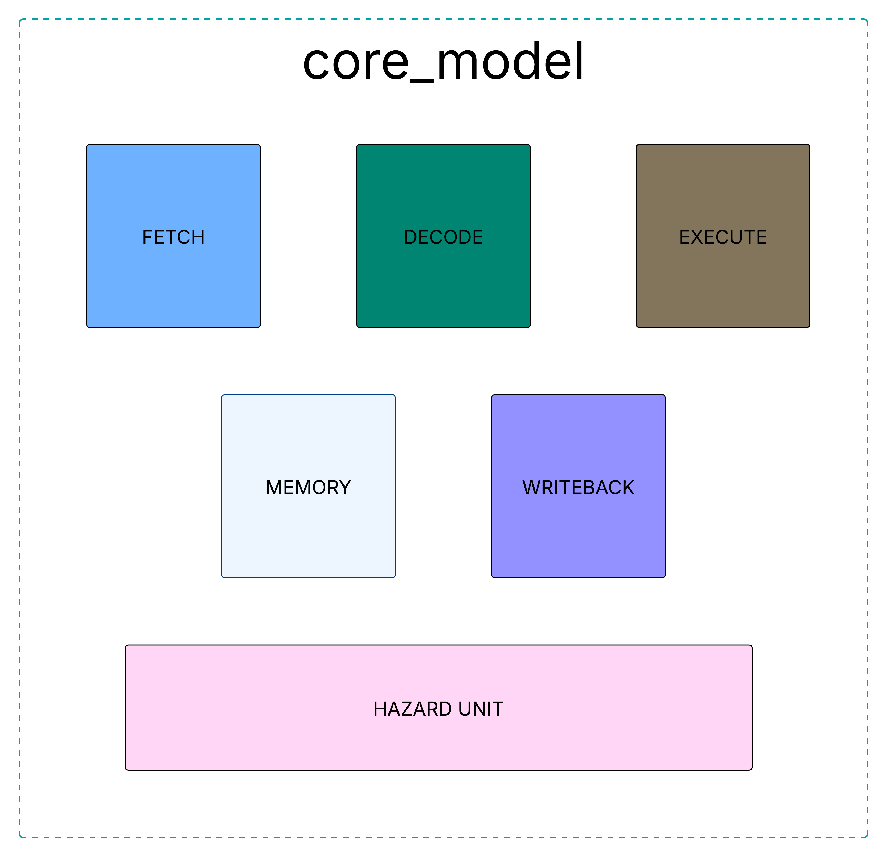
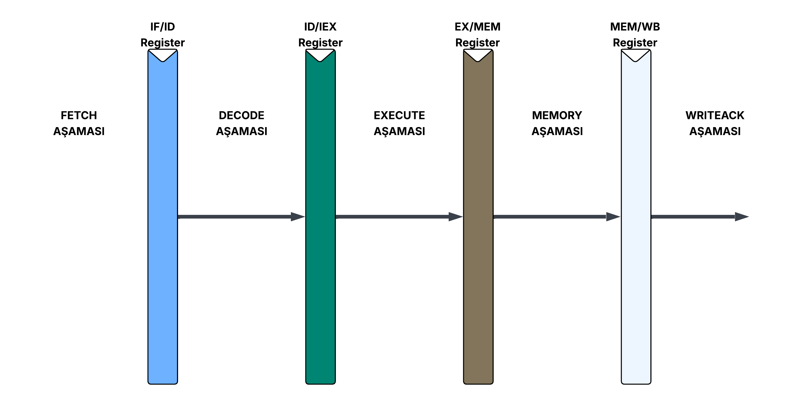

# RISCV32IM — 32-Bit Pipelined RISC-V Processor


> SystemVerilog ile yazılmış, RV32IM komut setini destekleyen 5 aşamalı pipeline mimarisine sahip bir RISC-V işlemci tasarımı.

---

## 📌 İçindekiler

- [Özellikler](#-özellikler)
- [Desteklenen Komutlar](#-desteklenen-komutlar)
- [Blok Diyagramı](#-blok-diyagramı)
- [Proje Yapısı](#-proje-yapısı)
- [Gereksinimler](#-gereksinimler)
- [Kurulum ve Çalıştırma](#-kurulum-ve-çalıştırma)
- [Proje Sunumu](#-proje-sunumu)
- [Kaynaklar](#-kaynaklar)

---

## 🚀 Özellikler

| Özellik | Açıklama |
|---------|----------|
| **Komut Seti** | RISC-V RV32IM (Tamsayı + Çarpma/Bölme Uzantısı) |
| **Pipeline** | 5 Aşama — Fetch (IF), Decode (ID), Execute (EX), Memory (MEM), Write-Back (WB) |
| **Veri Tehlikesi** | Forwarding birimi ve stall mekanizması ile çözümlenir |
| **Kontrol Tehlikesi** | Stall ve flush yöntemleri ile ele alınır |
| **Doğrulama** | Verilator simülasyonu + Spike referans karşılaştırması ile 20 test senaryosu |

---

## 📋 Desteklenen Komutlar

<details>
<summary><strong>RV32I — Temel Tamsayı Komut Seti</strong> (tıklayarak aç)</summary>

| Tür | Komutlar |
|-----|----------|
| **R-Type (ALU)** | `ADD`, `SUB`, `SLL`, `SLT`, `SLTU`, `XOR`, `SRL`, `SRA`, `OR`, `AND` |
| **I-Type (ALU Immediate)** | `ADDI`, `SLTI`, `SLTIU`, `XORI`, `ORI`, `ANDI`, `SLLI`, `SRLI`, `SRAI` |
| **I-Type (Load)** | `LB`, `LH`, `LW`, `LBU`, `LHU` |
| **S-Type (Store)** | `SB`, `SH`, `SW` |
| **B-Type (Branch)** | `BEQ`, `BNE`, `BLT`, `BGE`, `BLTU`, `BGEU` |
| **J-Type (Jump)** | `JAL`, `JALR` |
| **U-Type (Upper Imm.)** | `LUI`, `AUIPC` |

</details>

<details>
<summary><strong>M-Extension — Çarpma ve Bölme Komutları</strong> (tıklayarak aç)</summary>

| Tür | Komutlar |
|-----|----------|
| **Çarpma** | `MUL`, `MULH`, `MULHSU`, `MULHU` |
| **Bölme** | `DIV`, `DIVU`, `REM`, `REMU` |

</details>

---

## 📊 Blok Diyagramı

<p align="center">
  
</p>

<p align="center">
  
</p>

---

## 📂 Proje Yapısı

```text
.
├── src/                        # İşlemci kaynak kodları (SystemVerilog)
│   ├── core_model.sv           #   → Ana işlemci modülü (pipeline aşamaları, hazard birimi, M-ext)
│   └── pkg/
│       └── riscv_pkg.sv        #   → RISC-V sabit tanımları ve veri tipleri
│
├── tb/
│   └── tb.sv                   # Testbench modülü
│
├── riscv-tests/                # Test altyapısı
│   ├── asm_sources/            #   → Assembly test dosyaları (.s) — 20 test senaryosu
│   ├── full_build3.py          #   → Assembly→HEX dönüşüm ve Spike golden log üretim scripti
│   └── linker.ld               #   → Linker scripti
│
├── docs/
│   └── LatexSunum/             # LaTeX (Beamer) sunum dosyaları
│       ├── slides.pdf          #   → Proje sunumu (PDF)
│       └── images/             #   → Diyagram ve şekiller
│
├── makefile                    # Verilator derleme ve simülasyon komutları
├── verify_tests.py             # Otomatik test doğrulama scripti
└── README.md
```

---

## 🔧 Gereksinimler

Projeyi çalıştırabilmek için aşağıdaki araçların sisteminizde kurulu olması gerekmektedir:

| Araç | Açıklama | Kurulum |
|------|----------|---------|
| **Verilator** (≥ v4.0) | SystemVerilog simülasyonu | [verilator.org](https://verilator.org/guide/latest/install.html) |
| **Python 3** | Test otomasyon scriptleri | `sudo apt install python3` |
| **RISC-V Toolchain** | Assembly derleme (`riscv64-unknown-elf-*`) | [github.com/riscv-collab/riscv-gnu-toolchain](https://github.com/riscv-collab/riscv-gnu-toolchain) |
| **Spike** | RISC-V ISA simülatörü (golden referans üretimi) | [github.com/riscv-software-src/riscv-isa-sim](https://github.com/riscv-software-src/riscv-isa-sim) |
| **GTKWave** *(opsiyonel)* | Waveform görüntüleme | `sudo apt install gtkwave` |

---

## ⚙️ Kurulum ve Çalıştırma

### 1 — Projeyi Klonlama

```bash
git clone https://github.com/Scob34/RISCV32IM.git
cd RISCV32IM
```

### 2 — Derleme ve Lint Kontrolü

```bash
# Verilator ile lint kontrolü
make lint

# Verilator ile derleme (simülasyon binary'si oluşturur)
make build
```

### 3 — Tüm Testleri Otomatik Çalıştırma

Hazır test hex dosyalarını işlemcide koşturup Spike referans çıktılarıyla karşılaştırır:

```bash
python3 verify_tests.py
```

> **⚠️ Not:** Bu scriptin çalışabilmesi için Fetch aşamasındaki `$readmemh` bloğunun genel `instruction.hex` dosyasını okuması gerekmektedir:
> ```systemverilog
> initial $readmemh("instruction.hex", instruction_memory, 0, MEM_SIZE);
> ```

Başarılı bir çalıştırmada aşağıdakine benzer bir çıktı görürsünüz:

```
TEST NAME            : STATUS
------------------------------
alu                  : PASS
beq                  : PASS
mul                  : PASS
...
TÜM TESTLER GEÇTİ (20/20)
```

### 4 — Assembly'den Test Üretme

Kendi assembly testlerinizi oluşturmak veya mevcut `.s` dosyalarını yeniden derlemek için:

```bash
cd riscv-tests
python3 full_build3.py
```

Bu script şu adımları otomatik olarak gerçekleştirir:
1. `.s` dosyasını RISC-V toolchain ile derler (assemble + link)
2. `objdump` ile hex kodunu çıkarır
3. Spike simülatörü ile golden referans log dosyasını üretir

### 5 — Tek Bir Testi Elle Çalıştırma

Belirli bir test dosyasını elle koşturmak için:

```bash
# 1. Fetch aşamasındaki $readmemh yolunu ilgili test dosyasına yönlendirin:
#    $readmemh("./riscv-tests/{test_adı}/verification_output/{test_adı}_pure.hex", ...)

# 2. Simülasyonu çalıştırın
make run

# 3. (Opsiyonel) Waveform dosyasını görüntüleyin
make wave
```

### 6 — Temizlik

Derleme çıktılarını ve geçici dosyaları temizlemek için:

```bash
make clean
```

---

## 📑 Proje Sunumu

Pipeline mimarisi, veri yolu tasarımı ve performans analizi hakkında detaylı açıklamalar için proje sunumunu inceleyebilirsiniz:

[](docs/LatexSunum/slides.pdf)

---

## 📚 Kaynaklar

1. Harris, D. M., & Harris, S. L. (2021). *Digital Design and Computer Architecture: RISC-V Edition*. Morgan Kaufmann.
2. Patterson, D. A., & Hennessy, J. L. (2020). *Computer Organization and Design RISC-V Edition: The Hardware Software Interface*. Morgan Kaufmann.
3. Hennessy, J. L., & Patterson, D. A. (2017). *Computer Architecture: A Quantitative Approach*. Morgan Kaufmann.
4. [RISC-V Instruction Set Manual, Volume I: Unprivileged ISA](https://riscv.org/technical/specifications/)

---

**Yazar:** Fatih Sarıduman